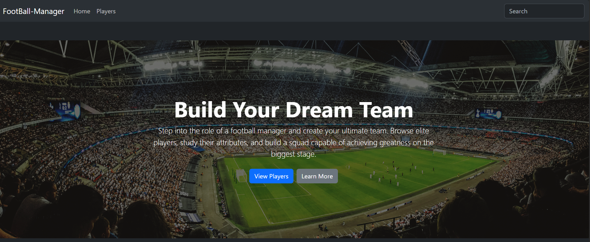
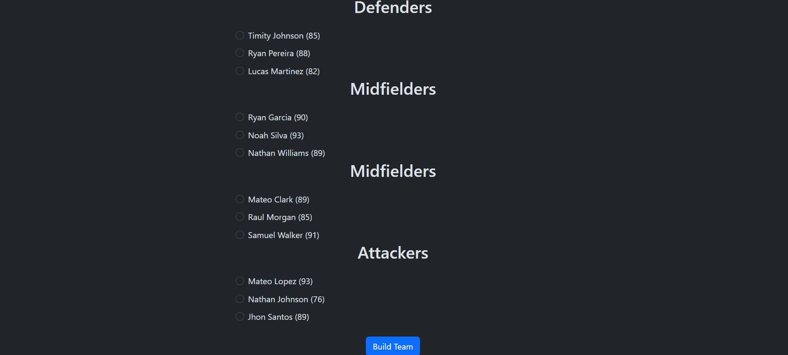
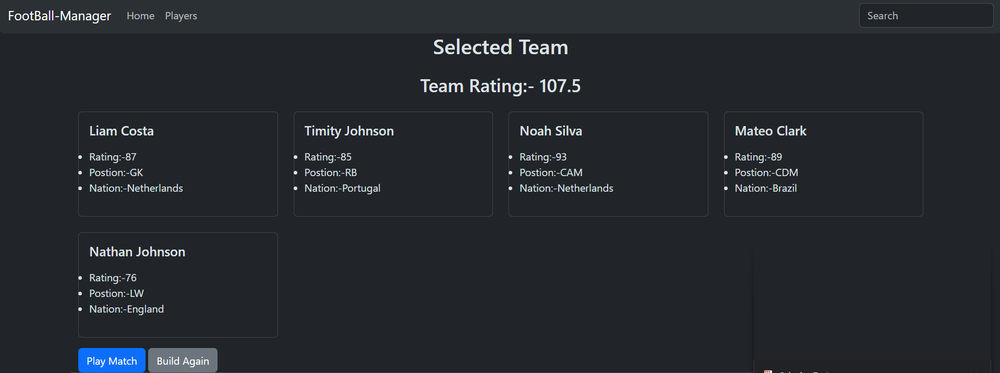
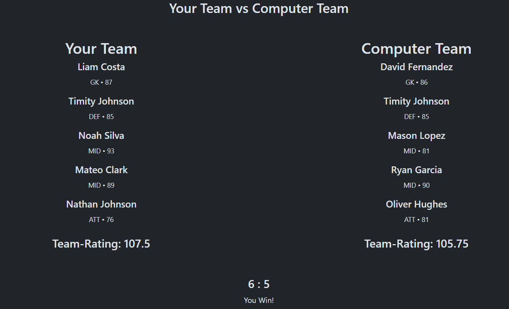

# Football Manager ⚽

Football Manager is a Flask-based football simulation game where users build a 5-a-side squad from randomly generated players and compete against computer-generated teams.

## Features

### Current Features

* Randomly generated football players
* Player database with ratings, positions, clubs, and nationalities
* Build a custom 5-a-side team
* Team rating calculation
* Computer-generated opponent teams
* Match simulation system
* Responsive Bootstrap interface

## Gameplay

1. Browse available players
2. Build your 5-a-side squad
3. Review your team's rating
4. Challenge a computer-generated team
5. View match results and compare performances

## Future Plans

* User Registration & Login
* Save Custom Teams
* Match History
* League System
* Tournament Mode
* Team Chemistry System
* Player Progression
* Seasonal Competitions

## Tech Stack

* Python
* Flask
* SQLAlchemy
* SQLite
* Bootstrap 5
* HTML
* CSS

## Installation

1. Clone the repository

```bash
git clone <repository-url>
```

2. Create and activate a virtual environment

```bash
python -m venv .venv
```

3. Install dependencies

```bash
pip install -r requirements.txt
```

4. Run the application

```bash
python app.py
```

5. Open your browser and visit

```text
http://127.0.0.1:5000
```

## Screenshots


### Homepage


### Team Builder


### Preview Team


### Match Simulation


## Author

Rohit Singh

## Status

✅ Active Development

Current Version: V2.0
